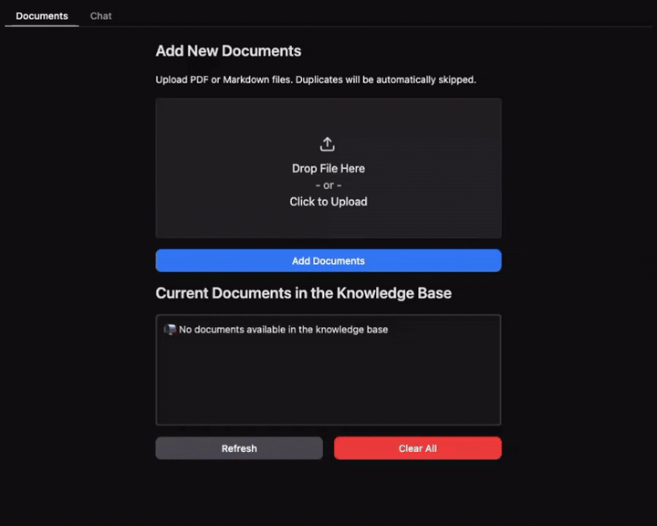

<p align="center">

</p>

<h1 align="center">Agentic RAG for Dummies</h1>

<p align="center">
  <strong>Build a production-ready Agentic RAG system with LangGraph, conversation memory, and human-in-the-loop query clarification</strong>
</p>

<p align="center">
  <a href="#overview">Overview</a> •
  <a href="#how-it-works">How It Works</a> •
  <a href="#llm-provider-configuration">LLM Providers</a> •
  <a href="#implementation">Implementation</a> •
  <a href="#installation--usage">Installation & Usage</a> •
  <a href="#upcoming-features">Upcoming Features</a>
</p>

<p align="center">
  <strong>Quickstart here 👉</strong> 
  <a href="https://colab.research.google.com/gist/GiovanniPasq/ffabe15fd3e3133b9759b5a7616a9da6/agentic_rag_for_dummies.ipynb">
    
  </a>
</p>

<p align="center">
  
</p>

<p align="center">
  <strong>If you like this project, a star ⭐️ would mean a lot :)</strong>
</p>

<p align="center" style="line-height: 1.6;">
  <em>✨ <strong>New:</strong></em><br>
  <em>• Comprehensive PDF → Markdown conversion guide, including tool comparisons and VLM-based approaches</em><br>
  <em>• End-to-end Gradio interface for a complete interactive RAG pipeline</em>
</p>

## Overview

This repository demonstrates how to build an **Agentic RAG (Retrieval-Augmented Generation)** system using LangGraph with minimal code. It implements:

- 🔍 **Hierarchical Indexing**: Search small, specific chunks (Child) for precision, retrieve larger Parent chunks for context
- 💬 **Conversation Memory**: Maintains context across multiple questions for natural dialogue
- 🔄 **Query Clarification**: Automatically rewrites ambiguous queries or asks for clarification
- 🧠 **Intelligent Evaluation**: Assesses relevance at the granular chunk level
- 🤖 **Agent Orchestration**: Uses LangGraph to coordinate the entire workflow
- ✅ **Self-Correction**: Re-queries if initial results are insufficient
- 🏗️ **Modular & Production-Ready**: Swap LLM providers, embeddings, databases, or chunking strategies independently. Clear separation between agent logic, storage, and UI makes customization straightforward.

This approach combines the **precision of small chunks** with the **contextual richness of large chunks**, while understanding conversation flow and resolving unclear queries. The **modular architecture** ensures every component—from document processing to retrieval logic—can be customized without breaking the system.

---

## Why This Repo?

Most RAG tutorials show basic concepts but lack production readiness. This repository bridges that gap by providing **both learning materials and deployable code**:

❌ **Typical RAG repos:**
- Simple pipelines that trade off precision vs context
- No conversation memory
- Static, non-adaptive retrieval
- Hard to customize for your use case
- No UI interface

✅ **This repo:**
- **Two learning paths**: Interactive notebook OR full app
- **Hierarchical indexing** for precision + context
- **Conversation memory** for natural dialogue
- **Human-in-the-loop** query clarification
- **Modular architecture** - swap any component
- **Provider-agnostic** - use any LLM (Ollama, OpenAI, Gemini, Claude)
- **UI interface** - end-to-end Gradio app with document management

---

## How It Works

The system uses a **four-stage intelligent workflow**:

```
User Query → Conversation Analysis → Query Clarification →
Agent Reasoning → Search Child Chunks → Evaluate Relevance →
(If needed) → Retrieve Parent Chunks → Generate Answer → Return Response
```

### Stage 1: Conversation Understanding

Before processing any query, the system:
1. **Analyzes recent conversation history** to extract key topics and context
2. **Summarizes relevant information** from previous exchanges
3. **Maintains conversational continuity** across multiple questions

### Stage 2: Query Clarification

The system intelligently processes the user's query:
1. **Resolves references** - Converts "How do I update it?" → "How do I update SQL?"
2. **Splits complex questions** - Breaks multi-part questions into focused sub-queries
3. **Detects unclear queries** - Identifies nonsense, insults, or vague questions
4. **Requests clarification** - Uses human-in-the-loop to pause and ask for details
5. **Rewrites for retrieval** - Optimizes query with specific, keyword-rich language

### Stage 3: Hierarchical Indexing

Documents are split twice:
- **Parent Chunks**: Large sections based on Markdown headers (H1, H2, H3)
- **Child Chunks**: Small, fixed-size pieces derived from parents

Storage:
- **Child Chunks** → Qdrant vector database (hybrid dense + sparse embeddings)
- **Parent Chunks** → JSON file store (retrieved by ID)

### Stage 4: Intelligent Retrieval

1. Agent searches child chunks for precision
2. Evaluates if results are sufficient
3. Fetches parent chunks for context if needed
4. Generates answer from complete information
5. Self-corrects and re-queries if insufficient

---

## LLM Provider Configuration

This system is **provider-agnostic** - you can use any LLM supported by LangChain. Choose the option that best fits your needs:

### Option 1: Ollama (Local - Recommended for Development)

**Install Ollama and download the model:**

```bash
# Install Ollama from https://ollama.com
ollama pull qwen3:4b-instruct-2507-q4_K_M
```

**Python code:**

```python
from langchain_ollama import ChatOllama

llm = ChatOllama(model="qwen3:4b-instruct-2507-q4_K_M", temperature=0)
```

---

### Option 2: Google Gemini (Cloud - Recommended for Production)

**Install the package:**

```bash
pip install -qU langchain-google-genai
```

**Python code:**

```python
import os
from langchain_google_genai import ChatGoogleGenerativeAI

# Set your Google API key
os.environ["GOOGLE_API_KEY"] = "your-api-key-here"
llm = ChatGoogleGenerativeAI(model="gemini-2.0-flash-exp", temperature=0)
```

---

### Option 3: OpenAI (Cloud)

**Install the package:**

```bash
pip install -qU langchain-openai
```

**Python code:**

```python
import os
from langchain_openai import ChatOpenAI

# Set your OpenAI API key
os.environ["OPENAI_API_KEY"] = "your-api-key-here"
llm = ChatOpenAI(model="gpt-4o-mini", temperature=0)
```

---

### Option 4: Anthropic Claude (Cloud)

**Install the package:**

```bash
pip install -qU langchain-anthropic
```

**Python code:**

```python
import os
from langchain_anthropic import ChatAnthropic

# Set your Anthropic API key
os.environ["ANTHROPIC_API_KEY"] = "your-api-key-here"
llm = ChatAnthropic(model="claude-3-5-sonnet-20241022", temperature=0)
```

---

### Important Notes

- **All providers** work with the exact same code - only the LLM initialization changes
- **Cost considerations:** Cloud providers charge per token, while Ollama is free but requires local compute

**💡 Recommendation:** Start with Ollama for development, then switch to Google Gemini or OpenAI for production.

---

## Implementation

### Step 1: Initial Setup and Configuration

Define paths and initialize core components.

```python
import os
from pathlib import Path
from langchain_huggingface import HuggingFaceEmbeddings
from langchain_qdrant.fastembed_sparse import FastEmbedSparse
from qdrant_client import QdrantClient

# Configuration
DOCS_DIR = "docs"  # Directory containing your pdfs files
MARKDOWN_DIR = "markdown" # Directory containing the pdfs converted to markdown
PARENT_STORE_PATH = "parent_store"  # Directory for parent chunk JSON files
CHILD_COLLECTION = "document_child_chunks"

os.makedirs(DOCS_DIR, exist_ok=True)
os.makedirs(PARENT_STORE_PATH, exist_ok=True)

from langchain_ollama import ChatOllama
llm = ChatOllama(model="qwen3:4b-instruct-2507-q4_K_M", temperature=0.1)

# Dense embeddings for semantic understanding
dense_embeddings = HuggingFaceEmbeddings(model_name="sentence-transformers/all-mpnet-base-v2")

# Sparse embeddings for keyword matching
sparse_embeddings = FastEmbedSparse(model_name="Qdrant/bm25")

# Qdrant client (local file-based storage)
client = QdrantClient(path="qdrant_db")
```

---

### Step 2: Configure Vector Database

Set up Qdrant to store child chunks with hybrid search capabilities.

```python
from qdrant_client.http import models as qmodels
from langchain_qdrant import QdrantVectorStore
from langchain_qdrant.qdrant import RetrievalMode

# Get embedding dimension
embedding_dimension = len(dense_embeddings.embed_query("test"))

def ensure_collection(collection_name):
    """Create Qdrant collection if it doesn't exist"""
    if not client.collection_exists(collection_name):
        client.create_collection(
            collection_name=collection_name,
            vectors_config=qmodels.VectorParams(
                size=embedding_dimension,
                distance=qmodels.Distance.COSINE
            ),
            sparse_vectors_config={
                "sparse": qmodels.SparseVectorParams()
            },
        )
        print(f"✓ Created collection: {collection_name}")
    else:
        print(f"✓ Collection already exists: {collection_name}")
```

---

### Step 3: PDFs to Markdown

Convert the PDFs to Markdown. For more details about other techniques use this companion notebook:

📘 **[PDF to Markdown Converter](https://colab.research.google.com/gist/GiovanniPasq/a5f749f9f9f03f0ca90f8b480ec952ac/pdf_to_md.ipynb)**

```python
import os
import pymupdf.layout
import pymupdf4llm
from pathlib import Path
import glob

os.environ["TOKENIZERS_PARALLELISM"] = "false"

def pdf_to_markdown(pdf_path, output_dir):
    doc = pymupdf.open(pdf_path)
    md = pymupdf4llm.to_markdown(doc, header=False, footer=False, page_separators=True, ignore_images=True, write_images=False, image_path=None)
    md_cleaned = md.encode('utf-8', errors='surrogatepass').decode('utf-8', errors='ignore')
    output_path = Path(output_dir) / Path(doc.name).stem
    Path(output_path).with_suffix(".md").write_bytes(md_cleaned.encode('utf-8'))

def pdfs_to_markdowns(path_pattern, overwrite: bool = False):
    output_dir = Path(MARKDOWN_DIR)
    output_dir.mkdir(parents=True, exist_ok=True)

    for pdf_path in map(Path, glob.glob(path_pattern)):
        md_path = (output_dir / pdf_path.stem).with_suffix(".md")
        if overwrite or not md_path.exists():
            pdf_to_markdown(pdf_path, output_dir)

pdfs_to_markdowns("./docs/*.pdf")
```

---

### Step 4: Hierarchical Document Indexing

Process documents with the Parent/Child splitting strategy.

```python
import glob
import json
from langchain_text_splitters import MarkdownHeaderTextSplitter, RecursiveCharacterTextSplitter

if client.collection_exists(CHILD_COLLECTION):
    print(f"Removing existing Qdrant collection: {CHILD_COLLECTION}")
    client.delete_collection(CHILD_COLLECTION)
else:
    ensure_collection(CHILD_COLLECTION)

# Initialize vector store for child chunks
child_vector_store = QdrantVectorStore(
    client=client,
    collection_name=CHILD_COLLECTION,
    embedding=dense_embeddings,
    sparse_embedding=sparse_embeddings,
    retrieval_mode=RetrievalMode.HYBRID,
    sparse_vector_name="sparse"
)

def index_documents():
    headers_to_split_on = [("#", "H1"), ("##", "H2"),("###", "H3")]
    parent_splitter = MarkdownHeaderTextSplitter(headers_to_split_on=headers_to_split_on, strip_headers=False)
    child_splitter = RecursiveCharacterTextSplitter(chunk_size=500, chunk_overlap=100)

    MIN_PARENT_SIZE = 500 * 4

    all_parent_pairs, all_child_chunks = [], []

    md_files = sorted(glob.glob(os.path.join(MARKDOWN_DIR, "*.md")))
    if not md_files:
        print(f"⚠️  No .md files found in {MARKDOWN_DIR}/")
        return

    for doc_path_str in md_files:
        doc_path = Path(doc_path_str)
        print(f"📄 Processing: {doc_path.name}")

        try:
            with open(doc_path, "r", encoding="utf-8") as f:
                md_text = f.read()
        except Exception as e:
            print(f"❌ Error reading {doc_path.name}: {e}")
            continue

        parent_chunks = parent_splitter.split_text(md_text)

        merged_parents = []
        current = None

        for chunk in parent_chunks:
            if current is None:
                current = chunk
            else:
                current.page_content += "\n\n" + chunk.page_content

                for k, v in chunk.metadata.items():
                    if k in current.metadata:
                        current.metadata[k] = f"{current.metadata[k]} -> {v}"
                    else:
                        current.metadata[k] = v

            if len(current.page_content) >= MIN_PARENT_SIZE:
                merged_parents.append(current)
                current = None

        if current:
            merged_parents.append(current)

        for i, p_chunk in enumerate(merged_parents):
            parent_id = f"{doc_path.stem}_parent_{i}"

            p_chunk.metadata.update({"source": doc_path.stem + ".pdf", "parent_id": parent_id})

            all_parent_pairs.append((parent_id, p_chunk))

            children = child_splitter.split_documents([p_chunk])
            all_child_chunks.extend(children)

    if all_child_chunks:
        print(f"\n🔍 Indexing {len(all_child_chunks)} child chunks into Qdrant...")
        try:
            child_vector_store.add_documents(all_child_chunks)
            print("✓ Child chunks indexed successfully")
        except Exception as e:
            print(f"❌ Error indexing child chunks: {e}")
            return
    else:
        print("⚠️ No child chunks to index")
        return

    print(f"💾 Saving {len(all_parent_pairs)} parent chunks to JSON...")

    for item in os.listdir(PARENT_STORE_PATH):
        os.remove(os.path.join(PARENT_STORE_PATH, item))

    for parent_id, doc in all_parent_pairs:
        doc_dict = {
            "page_content": doc.page_content,
            "metadata": doc.metadata
        }
        filepath = os.path.join(PARENT_STORE_PATH, f"{parent_id}.json")
        with open(filepath, "w", encoding="utf-8") as f:
            json.dump(doc_dict, f, ensure_ascii=False, indent=2)

index_documents()
```

---

### Step 5: Define Agent Tools

Create the retrieval tools the agent will use.

```python
import json
from typing import List
from langchain_core.tools import tool

@tool
def search_child_chunks(query: str, k: int = 5) -> List[dict]:
    """Search for the top K most relevant child chunks.

    Args:
        query: Search query string
        k: Number of results to return
    """
    try:
        results = child_vector_store.similarity_search(query, k=k, score_threshold=0.7)
        return [
            {
                "content": doc.page_content,
                "parent_id": doc.metadata.get("parent_id", ""),
                "source": doc.metadata.get("source", "")
            }
            for doc in results
        ]
    except Exception as e:
        print(f"Error searching child chunks: {e}")
        return []

@tool
def retrieve_parent_chunks(parent_ids: List[str]) -> List[dict]:
    """Retrieve full parent chunks by their IDs.

    Args:
        parent_ids: List of parent chunk IDs to retrieve
    """
    unique_ids = sorted(list(set(parent_ids)))
    results = []

    for parent_id in unique_ids:
        file_path = os.path.join(PARENT_STORE_PATH, parent_id if parent_id.lower().endswith(".json") else f"{parent_id}.json")
        if os.path.exists(file_path):
            try:
                with open(file_path, "r", encoding="utf-8") as f:
                    doc_dict = json.load(f)
                    results.append({
                        "content": doc_dict["page_content"],
                        "parent_id": parent_id,
                        "metadata": doc_dict["metadata"]
                    })
            except Exception as e:
                print(f"Error loading parent chunk {parent_id}: {e}")

    return results

# Bind tools to LLM
llm_with_tools = llm.bind_tools([search_child_chunks, retrieve_parent_chunks])
```

---

### Step 6: Define State and Data Models

Create the state structure for conversation tracking.

```python
from langgraph.graph import MessagesState
from pydantic import BaseModel, Field
from typing import List

class State(MessagesState):
    """Extended state with conversation tracking"""
    questionIsClear: bool
    conversation_summary: str = ""

class QueryAnalysis(BaseModel):
    """Structured output for query analysis"""
    is_clear: bool = Field(description="Indicates if the user's question is clear and answerable")
    questions: List[str] = Field(description="List of rewritten, self-contained questions")
    clarification_needed: str = Field(description="Explanation if the question is unclear")
```

---

### Step 7: Define Agent System Prompt

Create the prompt that guides the agent's reasoning.

```python
from langchain_core.messages import SystemMessage

AGENT_SYSTEM_PROMPT = """
You are an intelligent assistant that MUST use the available tools to answer questions.

**MANDATORY WORKFLOW — Follow these steps for EVERY question:**

1. **Call `search_child_chunks`** with the user's query (K = 3–7).

2. **Review the retrieved chunks** and identify the relevant ones.

3. **For each relevant chunk, call `retrieve_parent_chunks`** using its parent_id to get full context.

4. **If the retrieved context is still incomplete, retrieve additional parent chunks** as needed.

5. **If metadata helps clarify or support the answer, USE IT**  

6. **Answer using ONLY the retrieved information**
   - Cite source files from metadata.

7. **If no relevant information is found,** rewrite the query into an **answer-focused declarative statement** and search again **only once**.
"""

agent_system_message = SystemMessage(content=AGENT_SYSTEM_PROMPT)
```

---

### Step 8: Build Graph Node Functions

Create the processing nodes for the LangGraph workflow.

```python
from langchain_core.messages import HumanMessage, AIMessage, SystemMessage, RemoveMessage
from typing import Literal

def analyze_chat_and_summarize(state: State):
    """
    Analyzes chat history and summarizes key points for context.
    """
    if len(state["messages"]) < 4:  # Need some history to summarize
        return {"conversation_summary": ""}

    # Extract relevant messages (excluding current query and system messages)
    relevant_msgs = [
        msg for msg in state["messages"][:-1]  # Exclude current query
        if isinstance(msg, (HumanMessage, AIMessage))
        and not getattr(msg, "tool_calls", None)
    ]

    if not relevant_msgs:
        return {"conversation_summary": ""}

    summary_prompt = """**Summarize the key topics and context from this conversation concisely (1-2 sentences max).**
    Discard irrelevant information, such as misunderstandings or off-topic queries/responses.
    If there are no key topics, return an empty string.

    """
    for msg in relevant_msgs[-6:]:  # Last 6 messages for context
        role = "User" if isinstance(msg, HumanMessage) else "Assistant"
        summary_prompt += f"{role}: {msg.content}\n"

    summary_prompt += "\nBrief Summary:"
    summary_response = llm.with_config(temperature=0.3).invoke([SystemMessage(content=summary_prompt)])
    return {"conversation_summary": summary_response.content}

def analyze_and_rewrite_query(state: State):
    """
    Analyzes user query and rewrites it for clarity, optionally using conversation context.
    """
    last_message = state["messages"][-1]
    conversation_summary = state.get("conversation_summary", "")

    context_section = (
        f"**Conversation Context:**\n{conversation_summary}"
        if conversation_summary.strip()
        else "**Conversation Context:**\n[First query in conversation]"
    )

    # Create analysis prompt
    prompt = f"""
    **Rewrite the user's query** to be clear, self-contained, and optimized for information retrieval.

    **User Query:**
    "{last_message.content}"

    {context_section}

    **Instructions:**

    1. **Resolve references for follow-ups:** 
    - If the query uses pronouns or refers to previous topics, use the context to make it self-contained.

    2. **Ensure clarity for new queries:** 
    - Make the query specific, concise, and unambiguous.

    3. **Correct errors and interpret intent:** 
    - If the query is grammatically incorrect, contains typos, or has abbreviations, correct it and infer the intended meaning.

    4. **Split only when necessary:** 
    - If multiple distinct questions exist, split into **up to 3 focused sub-queries** to avoid over-segmentation.
    - Each sub-query must still be meaningful on its own.

    5. **Optimize for search:** 
    - Use **keywords, proper nouns, numbers, dates, and technical terms**. 
    - Remove conversational filler, vague words, and redundancies.
    - Make the query concise and focused for information retrieval.

    6. **Mark as unclear if intent is missing:** 
    - This includes nonsense, gibberish, insults, or statements without an apparent question.
    """

    llm_with_structure = llm.with_config(temperature=0.3).with_structured_output(QueryAnalysis)
    response = llm_with_structure.invoke([SystemMessage(content=prompt)])

    if response.is_clear:
        # Remove all non-system messages
        delete_all = [
            RemoveMessage(id=m.id)
            for m in state["messages"]
            if not isinstance(m, SystemMessage)
        ]

        # Format rewritten query
        rewritten = (
            "\n".join([f"{i+1}. {q}" for i, q in enumerate(response.questions)])
            if len(response.questions) > 1
            else response.questions[0]
        )
        return {
            "questionIsClear": True,
            "messages": delete_all + [HumanMessage(content=rewritten)]
        }
    else:
        clarification = response.clarification_needed or "I need more information to understand your question."
        return {
            "questionIsClear": False,
            "messages": [AIMessage(content=clarification)]
        }

def human_input_node(state: State):
    """Placeholder node for human-in-the-loop interruption"""
    return {}

def route_after_rewrite(state: State) -> Literal["agent", "human_input"]:
    """Route to agent if question is clear, otherwise wait for human input"""
    return "agent" if state.get("questionIsClear", False) else "human_input"

def agent_node(state: State):
    """Main agent node that processes queries using tools"""
    messages = [SystemMessage(content=agent_system_message.content)] + state["messages"]
    response = llm_with_tools.invoke(messages)
    return {"messages": [response]}
```

**Why this architecture?**
- **Summarization** maintains conversational context without overwhelming the LLM
- **Query rewriting** ensures search queries are precise and unambiguous
- **Human-in-the-loop** catches unclear queries before wasting retrieval resources
- **Routing logic** determines whether clarification is needed

---

### Step 9: Build the LangGraph Agent

Assemble the complete workflow graph with conversation memory.

```python
from langgraph.graph import START, StateGraph
from langgraph.prebuilt import ToolNode, tools_condition
from langgraph.checkpoint.memory import InMemorySaver

# Initialize checkpointer for conversation memory
checkpointer = InMemorySaver()

# Create graph builder
graph_builder = StateGraph(State)

# Add nodes
graph_builder.add_node("summarize", analyze_chat_and_summarize)
graph_builder.add_node("analyze_rewrite", analyze_and_rewrite_query)
graph_builder.add_node("human_input", human_input_node)
graph_builder.add_node("agent", agent_node)
graph_builder.add_node("tools", ToolNode([search_child_chunks, retrieve_parent_chunks]))

# Define edges
graph_builder.add_edge(START, "summarize")
graph_builder.add_edge("summarize", "analyze_rewrite")
graph_builder.add_conditional_edges("analyze_rewrite", route_after_rewrite)
graph_builder.add_edge("human_input", "analyze_rewrite")
graph_builder.add_conditional_edges("agent", tools_condition)
graph_builder.add_edge("tools", "agent")

# Compile graph with checkpointer
agent_graph = graph_builder.compile(
    checkpointer=checkpointer,
    interrupt_before=["human_input"]
)
```

**Graph flow:**
1. **START** → `summarize` (analyze conversation history)
2. `summarize` → `analyze_rewrite` (rewrite query with context)
3. `analyze_rewrite` → `agent` (if clear) OR `human_input` (if unclear)
4. `human_input` → `analyze_rewrite` (after user clarifies)
5. `agent` → `tools` (if needs retrieval) OR END (if answer ready)
6. `tools` → `agent` (return retrieved data)

---

### Step 10: Create Chat Interface

Build a Gradio interface with conversation persistence. For a complete end-to-end pipeline Gradio interface, including document ingestion, please refer to the project folder


```python
import gradio as gr
import uuid

def create_thread_id():
    """Generate a unique thread ID for each conversation"""
    return {"configurable": {"thread_id": str(uuid.uuid4())}}

def clear_session():
    """Clear thread for new conversation"""
    global config
    agent_graph.checkpointer.delete_thread(config["configurable"]["thread_id"])
    config = create_thread_id()

def chat_with_agent(message, history):
    current_state = agent_graph.get_state(config)
    
    if current_state.next:
        # Resume interrupted conversation
        agent_graph.update_state(config,{"messages": [HumanMessage(content=message.strip())]})
        result = agent_graph.invoke(None, config)
    else:
        # Start new query
        result = agent_graph.invoke({"messages": [HumanMessage(content=message.strip())]},config)
    
    return result['messages'][-1].content

# Initialize thread configuration
config = create_thread_id()

# Create Gradio interface
with gr.Blocks() as demo:
    chatbot = gr.Chatbot(
        height=600,
        placeholder="<strong>Ask me anything!</strong><br><em>I'll search, reason, and act to give you the best answer :)</em>"
    )
    chatbot.clear(clear_session)
    gr.ChatInterface(fn=chat_with_agent, type="messages", chatbot=chatbot)

demo.launch()
```

**You're done!** You now have a fully functional Agentic RAG system with conversation memory and query clarification.

---

## Modular Architecture

The app (`project/` folder) is organized in modular components that can be easily customized:

### 📂 Project Structure
```
project/
├── app.py                    # Main Gradio application entry point
├── config.py                 # Configuration hub (models, chunk sizes, providers)
├── util.py                   # PDF to markdown conversion
├── document_chunker.py       # Chunking strategy
├── core/                     # Core RAG components orchestration
│   ├── chat_interface.py     
│   ├── document_manager.py   
│   └── rag_system.py         
├── db/                       # Storage management
│   ├── parent_store_manager.py  # Parent chunks storage (JSON)
│   └── vector_db_manager.py     # Qdrant vector database setup
├── rag_agent/                # LangGraph agent workflow
│   ├── edges.py              # Conditional routing logic
│   ├── graph.py              # Graph construction and compilation
│   ├── graph_state.py        # State definitions
│   ├── nodes.py              # Processing nodes (summarize, rewrite, agent)
│   ├── prompts.py            # System prompts
│   ├── schemas.py            # Pydantic data models
│   └── tools.py              # Retrieval tools
└── ui/                       # User interface
    └── gradio_app.py         # Gradio interface components
```

### 🔧 Customization Points

#### **Configuration (`config.py`)**
- **LLM Provider & Model**: Switch between Ollama, Claude, OpenAI, or Gemini
- **Embedding Model**: Configure embedding model for vector representations
- **Chunk Sizes**: Adjust child and parent chunk dimensions for optimal retrieval

#### **RAG Agent (`rag_agent/`)**
- **Workflow Customization**: Add or remove nodes and edges to modify the agent flow
- **System Prompts**: Tailor prompts in `prompts.py` for domain-specific applications
- **Retrieval Tools**: Extend or modify tools in `tools.py` to enhance retrieval capabilities
- **Graph Logic**: Customize conditional routing in `edges.py` and node processing in `nodes.py`

#### **Document Processing**
- **Markdown Conversion** (`util.py`): Replace PDF conversion tools with alternatives (e.g., PyMuPDF, pdfplumber, Unstructured)
- **Chunking Strategy** (`document_chunker.py`): Implement custom chunking algorithms (semantic, recursive, or hybrid approaches)

This modular design ensures flexibility for experimenting with different RAG techniques, LLM providers, and document processing pipelines.

## Installation & Usage

Sample pdf files can be found here: [javascript](https://www.tutorialspoint.com/javascript/javascript_tutorial.pdf), [blockchain](https://blockchain-observatory.ec.europa.eu/document/download/1063effa-59cc-4df4-aeee-d2cf94f69178_en?filename=Blockchain_For_Beginners_A_EUBOF_Guide.pdf), [microservices](https://cdn.studio.f5.com/files/k6fem79d/production/5e4126e1cefa813ab67f9c0b6d73984c27ab1502.pdf), [fortinet](https://www.commoncriteriaportal.org/files/epfiles/Fortinet%20FortiGate_EAL4_ST_V1.5.pdf(320893)_TMP.pdf)  

### Option 1: Quickstart Notebook (Recommended for Testing)

The easiest way to get started:

**Running in Google Colab:**
1. Click the **Open in Colab** badge at the top of this README
2. Create a `docs/` folder in the file browser
3. Upload your pdf files to the `docs/` folder
4. Run all cells from top to bottom
5. The chat interface will appear at the end

**Running Locally (Jupyter/VSCode):**
1. Install dependencies first `pip install -r requirements.txt`
2. Open the notebook in your preferred environment
3. Add your pdf files to the `docs/` folder
4. Run all cells from top to bottom
5. The chat interface will appear at the end

### Option 2: Full Python Project (Recommended for Development)

#### 1. Install Dependencies

```bash
# Create virtual environment (recommended)
python -m venv venv

# Activate it
# On macOS/Linux:
source venv/bin/activate
# On Windows:
.\venv\Scripts\activate

# Install packages
pip install -r requirements.txt
```

#### 2. Run the Application

```bash
python app.py
```

#### 3. Ask Questions

Open the local URL (e.g., `http://127.0.0.1:7860`) to start chatting.

### Example Conversations

**With Conversation Memory:**
```
User: "How do I install SQL?"
Agent: [Provides installation steps from documentation]

User: "How do I update it?"
Agent: [Understands "it" = SQL, provides update instructions]
```

**With Query Clarification:**
```
User: "Tell me about that thing"
Agent: "I need more information. What specific topic are you asking about?"

User: "The installation process for PostgreSQL"
Agent: [Retrieves and answers with specific information]
```

---

## Upcoming Features

| Feature | Release | Description | Status |
|---------|---------|-------------|--------|
| 📄 **Enhanced PDF Notebook** | Released on 4 Nov 2025 | Additional guidance with library comparisons and useful repositories | ✅ Implemented |
| 🎯 **End-to-End Gradio Interface** | Released on 15 Nov 2025 | Fully automated pipeline | ✅ Implemented |
| 🤖 **Multi-Agent Map-Reduce** | Dec 2025 | Parallel processing architecture | ⌛ In Progress |

---

## License

MIT License - Feel free to use this for learning and building your own projects!

---

## Contributing

Contributions are welcome! Open an issue or submit a pull request.
